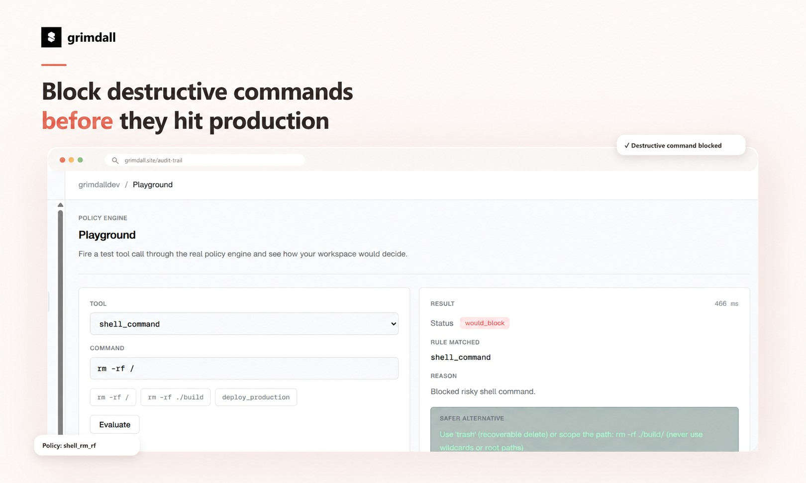
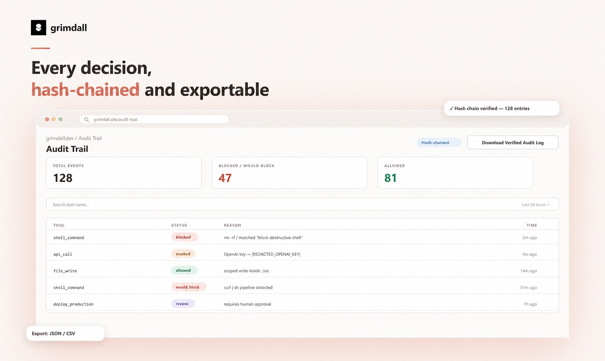
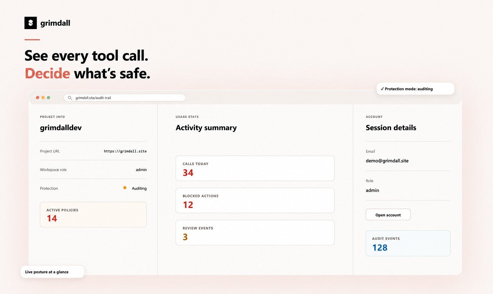
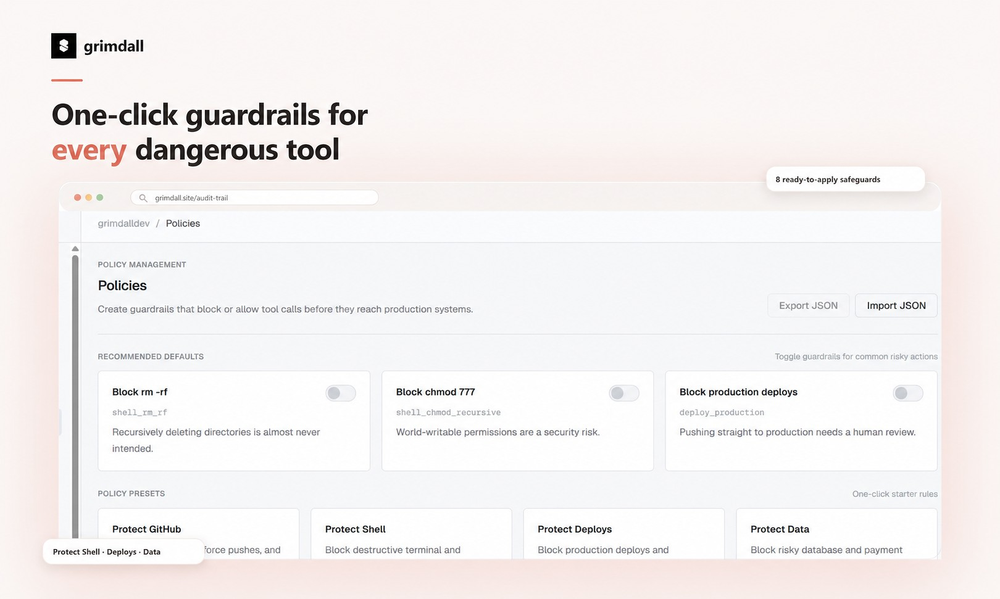

<div align="center">


**Runtime security for AI agents.**
Intercept every tool call. Enforce policy. Prove the audit.

[Website](https://grimdall.site) · [Docs](https://grimdall.site/docs) · [PyPI](https://pypi.org/project/grimdall/) · [npm](https://www.npmjs.com/package/grimdall) · [Security](SECURITY.md) · [Contributing](CONTRIBUTING.md)

[](https://www.npmjs.com/package/grimdall) [](https://pypi.org/project/grimdall/) [](LICENSE) []()

</div>



---

## The problem

AI agents now hold shell access, credentials, and deploy rights. One prompt-injected tool call can:

- `rm -rf /` a machine — or production
- `curl` your API keys to an attacker
- install a poisoned dependency at 3 a.m.

Existing tools either **watch after the fact** (observability), **live in a cloud proxy** (latency, trust), or **filter text** (guardrails) — nothing guards the exact moment an agent acts, on your machine, for free.

> Built in response to real incidents: **Mini Shai-Hulud** (npm supply-chain), **AWS Kiro CVE-2026-10591** (poisoned page hijacks a coding agent), **Hugging Face agent breach**.

## The solution

Grimdall is a **local-first runtime guard** between your agents and their tools:

```
tool call → intercept → evaluate policy → allow / block / review → hash-chained audit
```

- **One command.** No signup, no API key, no telemetry, works offline.
- **Two languages.** Node CLI hooks + a Python decorator — one shared audit chain.
- **Every framework.** Claude Code, Cursor, Codex, LangChain, CrewAI, OpenAI Agents, AutoGen.

---

## See it work

### 🛑 Block destructive commands — before they hit production
**Problem:** agents execute what they plan: `rm -rf /`, `chmod 777`, fork bombs, blind prod deploys.
**Solution:** deterministic policies evaluate every tool call *before execution* — and every block ships with a safer alternative.


### 🔗 Every decision, hash-chained and exportable
**Problem:** logs an agent writes about itself can't be trusted; auditors need evidence, not claims.
**Solution:** a SHA-256 hash-chained, tamper-evident audit trail. `grimdall audit verify` proves integrity; export JSON/CSV for compliance.



### 👁️ See every tool call. Decide what's safe.
**Problem:** teams have zero visibility into what agents actually do all day.
**Solution:** a live posture dashboard — calls today, blocked actions, review events, active policies. Start in **audit mode** (learn-only), flip to **enforce** when you trust the evidence.



### ⚙️ One-click guardrails for every dangerous tool
**Problem:** writing security policy from zero is slow and error-prone.
**Solution:** recommended defaults (block `rm -rf`, `chmod 777`, prod deploys) plus one-click presets — Protect GitHub, Shell, Deploys, Data. Import/export policies as JSON.



---

## Quickstart

**Protect coding agents (Node):**
```bash
npx grimdall init --hooks   # protects Claude Code, Cursor, Codex
npx grimdall demo           # watch it block rm -rf /
```

**Protect production agents (Python):**
```bash
pip install grimdall
```
```python
from grimdall import Guard

guard = Guard()  # zero-config, local-only

@guard.wrap
def execute_tool(tool_name, params):
    ...  # your existing executor — unchanged
```

Adapters: `grimdall.integrations.langchain` · `.crewai` · `.openai_agents` · `.autogen`

## CLI reference

| Command | What it does |
|---|---|
| `grimdall init --hooks` | Install agent hooks + default policies |
| `grimdall demo` | Live block demo (`rm -rf /`) |
| `grimdall audit verify` | Verify hash-chain integrity |
| `grimdall audit export` | Export trail as JSON/CSV |
| `grimdall doctor` | Health-check hooks & config |

## Roadmap

- [ ] **Spend guardrails** — hard budget caps per agent (alert → review → block)
- [ ] **Trust Layer** — Ed25519 agent identity, signed intent capsules, behavioral baselines
- [ ] **Industry policy packs** — fintech, healthcare, legal, e-commerce, crypto, enterprise

## Community & security

- Report vulnerabilities: see [SECURITY.md](SECURITY.md) — we respond fast.
- Contributions welcome: [CONTRIBUTING.md](CONTRIBUTING.md)
- License: Apache-2.0

<div align="center">
If Grimdall protects your agents, give it a ⭐ — it helps more builders find us.
</div>
