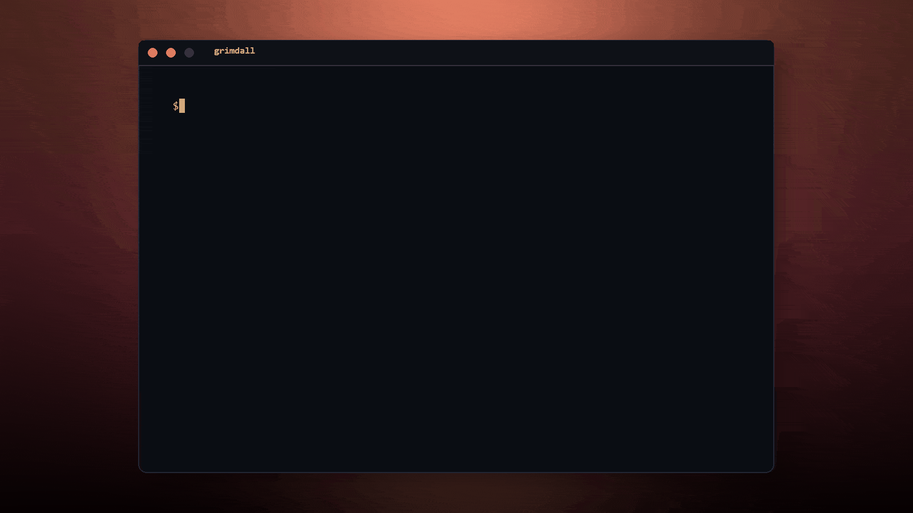

<div align="center">
  
  <h1>Grimdall</h1>
  <p>Runtime security for AI coding agents</p>
</div>

<p align="center">
  <strong>Stop rogue AI agents from deleting production.</strong><br>
  <em>Grimdall sits between your AI agents and their tools. If an agent tries to run destructive shell commands, drop database tables, or modify production configs, Grimdall blocks it instantly and alerts your team on Slack.</em>
</p>

<p align="center">
  <a href="https://grimdall.site">Website</a> •
  <a href="https://grimdall.site/docs">Documentation</a> •
  <a href="https://grimdall.site/blog">Blog</a>
</p>

<p align="center">
  <a href="https://www.npmjs.com/package/grimdall"></a>
  <a href="https://github.com/grimdalltech/grimdall-os/blob/main/LICENSE"></a>
  <a href="https://github.com/grimdalltech/grimdall-os/stargazers"></a>
</p>

<div align="center">
  <!-- TODO: Replace with actual demo GIF (grimdall demo blocking rm -rf /) -->
  <!--  -->
  <p><em>Watch it block destructive commands in 10 seconds — no setup required.</em></p>
</div>


## What is Grimdall?

Pointing an AI agent at your codebase without runtime security is like giving a toddler a chainsaw. **Grimdall is the runtime security layer** that stops agents from:

- Running destructive shell commands (`rm -rf /`, `chmod 777`, fork bombs)
- Leaking secrets (API keys, tokens, credentials)
- Modifying production configs
- Executing prompt injections

It sits between your agents (Claude Code, Cursor, Codex) and their tools, enforcing policies in real-time.

## What it does

- **Block destructive commands** — instantly stop `rm -rf /`, database drops, and production config changes.
- **Mask secrets** — redact keys/tokens/emails before they leave your machine.
- **Detect prompt injections** — catch jailbreaks before policy evaluation.
- **Enforce policies** — block, allow, or require review for any tool call.
- **Generate safer alternatives** — suggest `rm -rf ./build` instead of `rm -rf /`.
- **Tamper-evident audit trail** — SHA-256 hash chain, verifiable, exportable.

Built in response to real attacks: [Mini Shai-Hulud](https://thehackernews.com/2026/05/mini-shai-hulud-worm-compromises.html) npm supply chain attacks, [Kiro CVE-2026-10591](https://thehackernews.com/2026/07/aws-kiro-flaw-let-poisoned-web-page.html), and the [Hugging Face agent breach](https://thehackernews.com/2026/07/worlds-largest-ai-model-repository.html).

## Getting started

### Quickstart (10 seconds)

```bash
npx grimdall init --hooks  # Protects Claude Code, Cursor, Codex
npx grimdall demo          # Watch it block rm -rf /
```

### Full setup

#### 1. Install CLI

```bash
npm install -g grimdall
```

#### 2. Protect your agents

```bash
grimdall init --hooks
```

#### 3. Run the demo

```bash
grimdall demo
```

> **No configuration needed** — uses default policies for common risks (`rm -rf /`, `chmod 777`, fork bombs, repo deletion).

[See full docs →](https://grimdall.site/docs)

## Documentation

- [Full API reference](https://grimdall.site/docs)
- [Policy engine guide](https://grimdall.site/docs/policy-engine)
- [Agent hook setup](https://grimdall.site/docs/agent-hooks)
- [Supply chain guard](https://grimdall.site/docs/supply-chain-guard)

## Community and contributing

Join our [Discord](https://discord.gg/grimdall) for real-time help and discussions.

- **Questions?** → [GitHub Discussions](https://github.com/grimdalltech/grimdall-os/discussions)
- **Bugs?** → [Open an issue](https://github.com/grimdalltech/grimdall-os/issues/new?labels=bug&template=bug_report.md)
- **Contributing** → [CONTRIBUTING.md](CONTRIBUTING.md)
- **Security** → [SECURITY.md](SECURITY.md)

## License

Grimdall is licensed under the [Apache-2.0 License](LICENSE).
