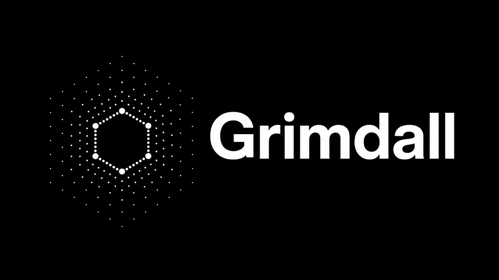

<div align="center">
  

  <strong>Runtime security for AI agents.</strong> Stops the tool calls that would delete your repo, nuke your shell, or leak your keys, then writes a tamper-evident, SHA-256 hash-chained audit trail you can verify with one command. Runs fully local: no signup, no telemetry, no API key.

  [](https://www.npmjs.com/package/grimdall)
  [](https://pypi.org/project/grimdall/)
  [](LICENSE)
  [](https://github.com/grimdalltech/grimdall-os/actions/workflows/ci.yml)
  [](https://x.com/Grimdal_Sec)

  
</div>

## 🔥 The Problem

You gave an AI coding agent terminal access so it could actually do work. But AI has senior engineer confidence and intern judgment.

- Agent hallucinates a variable? It runs `DROP TABLE users;`.
- Agent gets stuck in a loop? It force-pushes to `main`.
- Agent reads a poisoned webpage? It executes arbitrary shell commands.

By the time you realize what happened, your app is down.

## ⚡ Quickstart (Zero Friction)

No signup. No API key. No telemetry. Works offline. $0 forever.

**Node CLI** (protects Claude Code, Cursor, Codex):

```bash
npx grimdall init --hooks
```

**Python** (LangChain, CrewAI, OpenAI Agents SDK, AutoGen):

```bash
pip install grimdall
```

```python
from grimdall import guard

@guard.wrap  # That's it. Your agent is now blast-resistant.
def my_agent_function(prompt):
    # your agent logic here
```

## 🤖 Vibe Coder?

Paste this to your agent and go:

> Integrate grimdall into this project by following AGENT_INTEGRATIONS.md in github.com/grimdalltech/grimdall-os

## 🧪 Try It in 30 Seconds

```bash
npx grimdall demo        # watch it block rm -rf / live
grimdall audit:verify    # prove the hash chain is intact
grimdall doctor          # sanity-check your setup
```

## 🛠️ How It Works (The Solution)

Every tool call goes through the Grimdall core loop:

```
tool call → intercept → evaluate policy → allow / block / review → hash-chained audit
```

**Default protections (out of the box):**

- Blocks destructive shell calls: `rm -rf` and fork bombs.
- Blocks destructive SQL: `DROP TABLE` and `TRUNCATE`.
- Blocks path-traversal patterns (`..\`).
- Forces network commands (`curl`) to human-in-the-loop review.
- Secret masking (redacts API keys and tokens before they're written to the audit log).
- Prompt-injection detection (shell-destructive, SQL, and path-traversal patterns) with a weighted risk score.

## 🧩 Features

**The unique part: cross-language audit trail.** Most tools support one language. Grimdall has a Node CLI and a Python runtime — both write to the exact same SHA-256 hash-chained, tamper-evident audit trail. Verify what your Python LangChain agent did using the Node CLI. Cryptographic proof of what was attempted, whether it was blocked, and when.

- **Policy enforcement** — declarative `allow` / `block` / `review` policies with wildcard tool matching.
- **Secret masking** — deep-clones call arguments and redacts OpenAI keys, AWS keys, GitHub tokens, bearer tokens.
- **Injection detection** — weighted risk score for shell-destructive, SQL-destructive, and path-traversal patterns.
- **Human-in-the-loop Slack alerts** — blocked calls can ping a Slack webhook in real time.
- **`grimdall demo`** — watch it block `rm -rf /` live.
- **`grimdall audit:verify`** — one command proves the chain is intact.
- **Audit export** — `grimdall audit export` to JSON/CSV for your SOC team.
- **Safer-alternative suggestions** — when a command is blocked, suggest the safe version.

## 🎚️ Modes: Audit vs Enforce

- **`audit`** (shadow / learn-only mode): logs what *would* be blocked, blocks nothing. Run this for a week before switching.
- **`enforce`**: real blocking + review gates.

Switch with the CLI (`grimdall mode audit` → learn-only, `grimdall mode enforce` → hard enforcement). Start in `audit`, graduate to `enforce`.

## ⚠️ Caution — Read This

> Grimdall is a guardrail, not a force field. It reduces blast radius — it does not replace sandboxing, least-privilege credentials, or backups. Run agents with the smallest permissions possible, keep immutable backups, and treat `review` actions as real decisions, not checkbox clicks.

## 📋 Compliance

Grimdall writes a tamper-evident, hash-chained record of every tool call it evaluates. Each entry is signed with an ed25519 key and commits to the previous hash — alter any entry and the chain breaks. You can verify integrity with grimdall audit:verify and inspect the log with grimdall audit:view.


Grimdall is evidence infrastructure, not a certified compliance product.

## 🗺️ Roadmap

- **Spend guardrails** — hard budget caps per agent (alert → review → block on token/cost spend).
- **Trust layer** — Ed25519 agent identity and signed intent capsules.
- **Industry policy packs** — fintech/healthcare presets aligned to SOC 2 / HIPAA-style frameworks.

## 💬 Community & Support

- 🐛 [Report a bug / request a feature](https://github.com/grimdalltech/grimdall-os/issues)
- 📧 aniket@grimdall.site

---

Apache-2.0 License. Built by a solo founder who got tired of being terrified of his own code. If this saved your prod database, give it a star. 🙏